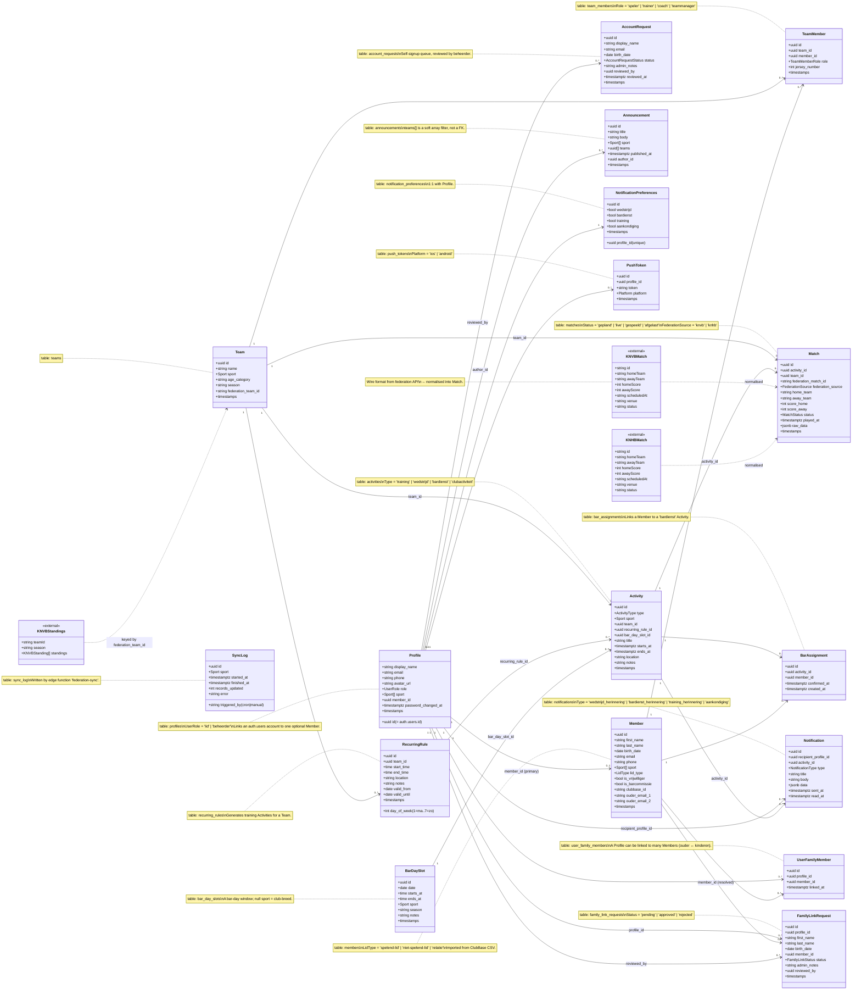

# Class Structure

Overview of the main domain entities in the SC Muiden App, the Supabase tables that back them, and the relationships between them.

Sources:
- Supabase migrations in [supabase/migrations/](../supabase/migrations/)
- Generated DB types: [packages/shared/src/types/db.types.ts](../packages/shared/src/types/db.types.ts)
- Domain types: [packages/shared/src/types/app.types.ts](../packages/shared/src/types/app.types.ts)
- Federation types: [packages/shared/src/types/federation.types.ts](../packages/shared/src/types/federation.types.ts)

---

## Diagram

---

## Domain groups

### Identity & family

| Class | Table | Purpose |
|---|---|---|
| `Profile` | `profiles` | Extends `auth.users` with display name, role and a primary `member_id`. Created on signup via `handle_new_user` trigger ([20260515115558_fix_handle_new_user_trigger.sql](../supabase/migrations/20260515115558_fix_handle_new_user_trigger.sql)). |
| `Member` | `members` | Person record imported from ClubBase. Independent of auth — a Member can exist without a login. Carries flags `is_vrijwilliger`, `is_barcommissie` and `lid_type` used by the bardienst-roster. |
| `UserFamilyMember` | `user_family_members` | Many-to-many link between a `Profile` (e.g. an ouder) and the `Member` rows for their kinderen. Drives the family-aggregated activity feed. |
| `FamilyLinkRequest` | `family_link_requests` | Pending request from a user to be linked to a `Member`; resolved by a `beheerder`. |
| `AccountRequest` | `account_requests` | Self-signup queue ([20260513161501_account_requests.sql](../supabase/migrations/20260513161501_account_requests.sql)). |

`Profile.member_id` is the *own* Member of the account holder; additional family members live in `user_family_members`.

### Teams

| Class | Table | Purpose |
|---|---|---|
| `Team` | `teams` | A team for a season + sport (voetbal of hockey), optionally linked to a federation team via `federation_team_id`. |
| `TeamMember` | `team_members` | Junction of `Member` ↔ `Team` with a role (`speler`, `trainer`, `coach`, `teammanager`) and optional jersey number. |

### Activities & scheduling

| Class | Table | Purpose |
|---|---|---|
| `Activity` | `activities` | Single source of truth for everything that appears on the calendar: trainings, wedstrijden, bardiensten, clubactiviteiten. |
| `RecurringRule` | `recurring_rules` | Weekly recurrence (e.g. "elke dinsdag 19:00") that materialises into `Activity` rows for a `Team`. |
| `Match` | `matches` | Wedstrijd-specific data (score, status, home/away). Optionally tied to an `Activity` and a `Team`. Sourced from federation sync. |

`Activity.bar_day_slot_id` ties bardienst-activiteiten back to the bar-day window they belong to.

### Bardienst rooster

| Class | Table | Purpose |
|---|---|---|
| `BarDaySlot` | `bar_day_slots` | A bar day with a date + open/close time + season; introduced in [20260515052815_bardienst_rooster.sql](../supabase/migrations/20260515052815_bardienst_rooster.sql). `sport = null` betekent club-breed. |
| `BarAssignment` | `bar_assignments` | Assignment of a `Member` to a `bardienst` `Activity`, optionally `confirmed_at`. |

The roster generator produces a `BarRosterPreview` (in-memory shape, not a table) shaped as `BarShift[]` per `BarDaySlot`.

### Communicatie

| Class | Table | Purpose |
|---|---|---|
| `Announcement` | `announcements` | Aankondiging gericht op alle leden, een sport, of een set teams (soft array filter). |
| `Notification` | `notifications` | Individuele push-/in-app notificatie voor één `Profile`. Inserted by app code; delivery is fired by edge function `push-trigger`. |
| `NotificationPreferences` | `notification_preferences` | 1:1 voorkeuren per `Profile` voor de vier notificatietypes. |
| `PushToken` | `push_tokens` | Expo push token per device. |

### Federation sync

| Class | Source | Purpose |
|---|---|---|
| `SyncLog` | `sync_log` | Audit trail for federation-sync runs. |
| `KNVBMatch`, `KNHBMatch`, `KNVBStandings` | external API DTOs | Wire formats from KNVB/KNHB. Normalised into `Match` and standings views; the app never calls federation APIs directly. |

---

## Type ↔ table mapping

The TypeScript domain interfaces in [app.types.ts](../packages/shared/src/types/app.types.ts) are the canonical shapes used by the mobile app and CMS. Each maps 1:1 to a Supabase table:

| Domain type | Table |
|---|---|
| `Profile` | `profiles` |
| `Member` | `members` |
| `UserFamilyMember` | `user_family_members` |
| `FamilyLinkRequest` | `family_link_requests` |
| `AccountRequest` | `account_requests` |
| `Team` | `teams` |
| `TeamMember` | `team_members` |
| `Activity` | `activities` |
| `RecurringRule` | `recurring_rules` |
| `Match` | `matches` |
| `BarDaySlot` | `bar_day_slots` |
| `BarAssignment` | `bar_assignments` |
| `Announcement` | `announcements` |
| `Notification` / `NotificationWithMeta` | `notifications` |
| `NotificationPreferences` | `notification_preferences` |
| `PushToken` | `push_tokens` |
| `SyncLog` | `sync_log` |

Composite/UI types (`ActivityWithDetails`, `BarAssignmentWithMember`, `TeamWithMemberCount`, `BarRosterPreview`, `MatchWithActivity`, `CsvImportRow`/`CsvImportResult`, `DashboardStats`) are derived shapes and have no table of their own.
